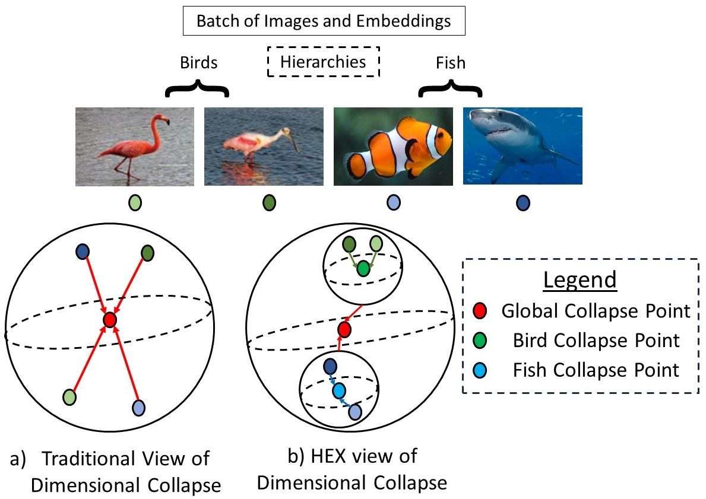
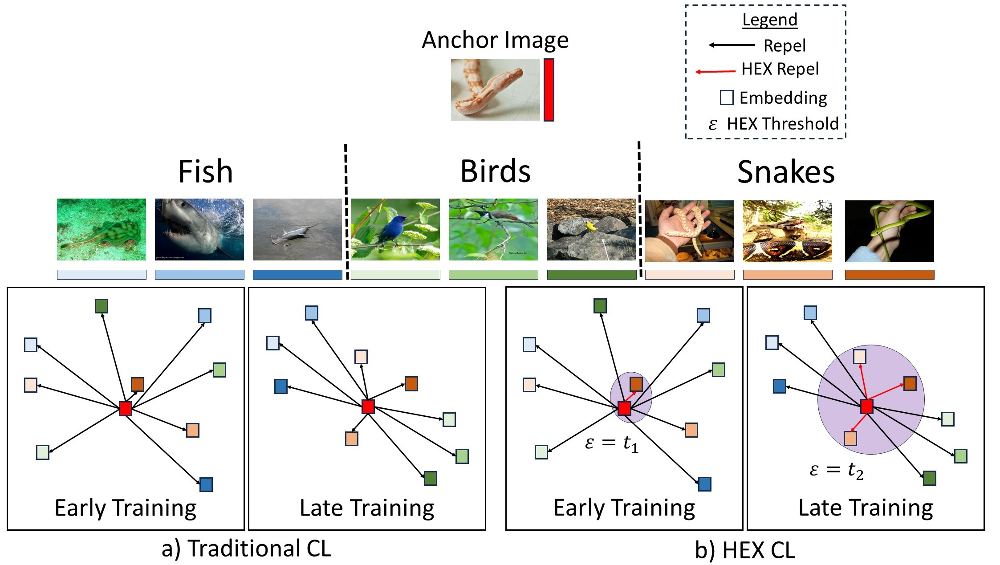
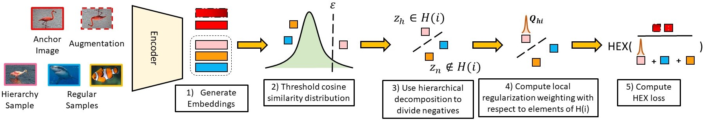

# HEX: Hierarchical Emergence Explotation for Self Supervised Algorithms
***

This work was done in the [Omni Lab for Intelligent Visual Engineering and Science (OLIVES) @ Georgia Tech](https://ghassanalregib.info/). 
It has recently been accepted as an Oral Presentation at the Winter Applications of Computer Vision 2025!!
Feel free to check our lab's [Website](https://alregib.ece.gatech.edu/) 
and [GitHub](https://github.com/olivesgatech) for other interesting work!!!

***

## Abstract
In this paper, we propose an algorithm that can be used on top of a wide variety of self-supervised (SSL) approaches to take advantage of hierarchical structures that emerge during training. SSL approaches typically work through some invariance term to ensure consistency between similar samples and a regularization term to prevent global dimensional collapse. Dimensional collapse refers to data representations spanning a lower-dimensional subspace. Recent work has demonstrated that the representation space of these algorithms gradually reflects a semantic hierarchical structure as training progresses. Data samples of the same hierarchical grouping tend to exhibit greater dimensional collapse locally compared to the dataset as a whole due to sharing features in common with each other. Ideally, SSL algorithms would take advantage of this hierarchical emergence to have an additional regularization term to account for this local dimensional collapse effect. However, the construction of existing SSL algorithms does not account for this property. To address this, we propose an adaptive algorithm that performs a weighted decomposition of the denominator of the InfoNCE loss into two terms: local hierarchical and global collapse regularization respectively. This decomposition is based on an adaptive threshold that gradually lowers to reflect the emerging hierarchical structure of the representation space throughout training. It is based on an analysis of the cosine similarity distribution of samples in a batch. We demonstrate that this hierarchical emergence exploitation (HEX) approach can be integrated across a wide variety of SSL algorithms. Empirically, we show performance improvements of up to 5.6\% relative improvement over baseline SSL approaches on classification accuracy on Imagenet with 100 epochs of training.  


## Visual Abstract
Our method is motivated by the idea that samples from the same hierarchical grouping shares features in
common with each other. Therefore, they are prone to potentially collapsing to the same  point at
a local level.

However, previous work has observed that SSL algorithms tend to produce hierarchiacally aligned representations during training.
This makes it possible to create an adaptive term that changes over the course of training to gradually introduce more 
localized regularization to the training process.

We show details of our exact method below:


## Code Usage
1. Go to scripts/pretrain/dataset_of_choice
2. Modify the script to have the parameters of interest for your experiment.
3. Within this script, there is a field where you can specify the "method" and its "type"
4. Type can be set to HEX_fixed or HEX_adaptive to specify the manner in which localized regularization is added throughout training.
5. On the command line you can initiate training of the backbone with:
```
python3 main_pretrain.py scripts/pretrain/dataset_of_interest script.yaml
```
6. All other functionalities are the same as in the solo-learn codebase.


## Citation

```bibtex
@article{WACV2025,
  author  = {Kiran Kokilepersaud and Seulgi Kim and Mohit Prabhushankar and Ghassan AlRegib},
  title   = {HEX: Hierarchical Emergence Exploitation in Self-Supervised Algorithms},
  journal = {Winter Applications of Computer Vision (WACV)},
  year    = {2025},
  url     = {https://arxiv.org/pdf/2410.23200?}
}
```
## Links

**Assiociated Website**: https://alregib.ece.gatech.edu/

**Code Acknowledgement**: Code draws partially from the following codebase(s):

* https://github.com/vturrisi/solo-learn